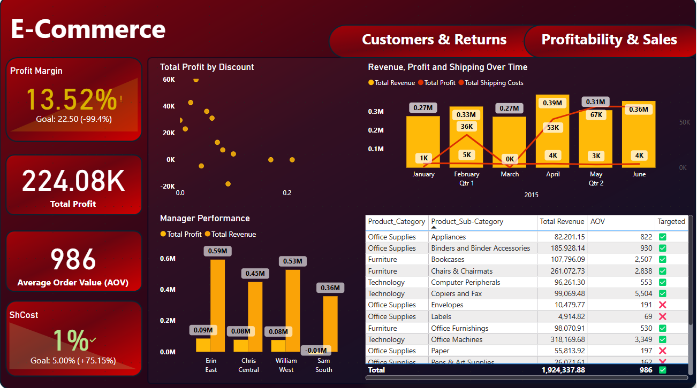
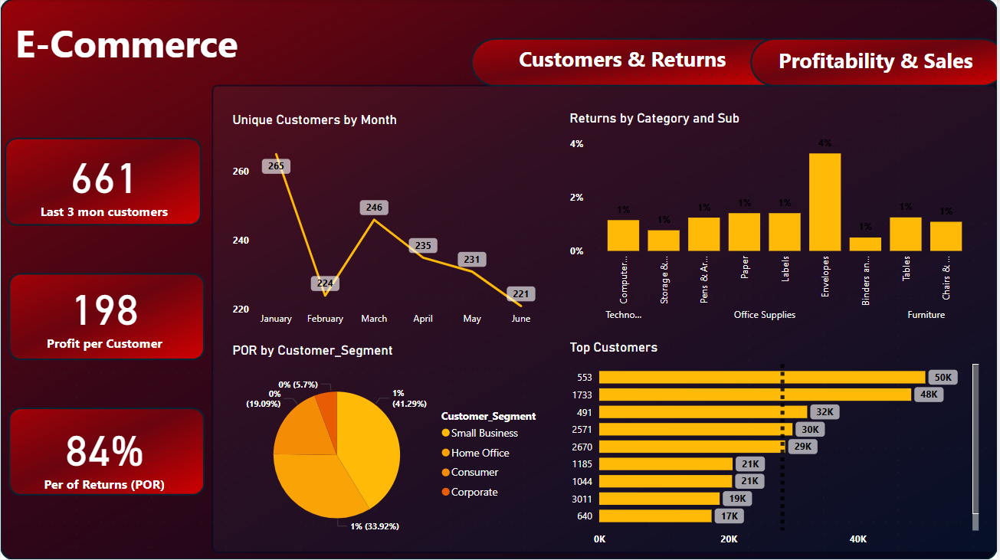
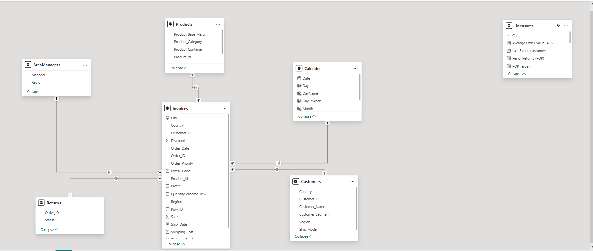

# 📊 E-Commerce Sales & Customer Performance Analysis

## Overview

This Power BI project provides a deep-dive analysis of an e-commerce dataset to evaluate sales performance, customer behavior, profitability, and returns. The goal is to extract actionable insights to guide business strategy, focusing on metrics such as profit margin, customer retention, return rate, and product profitability.

The analysis is presented through two main dashboards:
- **Profitability & Sales Performance**
- **Customer Acquisition, Retention & Returns**

Both dashboards include interactive filters, KPIs, and custom tooltips to support dynamic business decision-making.

---

## 📁 Dataset Structure

The data consists of the following main tables:

- **AreaManagers** – Manager and Region assignments
- **Customers** – Customer details and segmentation
- **Invoices** – Sales, profit, order details, and product transactions
- **Products** – Product metadata and pricing structure
- **Returns** – Returned orders and their statuses

---

## 🎯 Business Objectives

1. **Evaluate overall sales and profitability performance**
2. **Understand customer behavior and retention**
3. **Identify return patterns by segment and category**
4. **Track regional and managerial performance**
5. **Determine product and category profitability**
6. **Compare actuals against business goals (e.g., profit margin target)**

---

## 📊 Dashboard 1: Profitability & Sales Performance

### KPIs:
- **Profit Margin %** (with goal indicator)
- **Total Profit**
- **Average Order Value (AOV)**
- **Shipping Cost %** (vs target)

### Key Visuals:
- **Profit by Discount Scatter Plot** – Measures the impact of discounting on profits  
- **Revenue, Profit, and Shipping Over Time** – Tracks performance trends monthly  
- **Manager Performance Bar Chart** – Compares profit and revenue by Area Manager  
- **Product Performance Table** – Displays Revenue, AOV, and Target Achievement by Product Category  

This dashboard was designed to analyze the **financial performance** of the business. Our aim was to evaluate profitability at different levels—monthly, by region, and by product—and to determine whether key performance metrics were on track. Questions we focused on included: *Are we achieving our profit margin goals? Are certain managers or regions underperforming? Are discounts having a negative impact on profit?*

The insights revealed that the **overall profit margin was 13.52%**, which falls significantly short of the **target of 22.5%**. A major contributor to this was **over-discounting**, clearly shown in the **Profit by Discount scatter plot**, where high discounts aligned with lower profits. The **Revenue and Profit over Time chart** showed inconsistencies across months, suggesting periods of inefficient operations. One of the most notable insights came from the **Manager Performance Bar Chart**, which highlighted that **some managers generated revenue but had negative profits**, suggesting cost mismanagement or inefficient logistics in those regions. The **Product Performance Table** further showed that while some sub-categories contributed high revenue, they failed to hit profitability targets—indicating a need to reassess pricing or marketing strategies for those products.

---

## 👥 Dashboard 2: Customer Acquisition, Retention & Returns

### KPIs:
- **Last 3-Month Active Customers**
- **Profit per Customer**
- **Percent of Returns (PoR)**

### Key Visuals:
- **Unique Customers Over Time Line Chart** – Tracks customer acquisition and retention trends  
- **Returns by Sub-Category Bar Chart** – Shows which product lines are being returned most  
- **Percent of Returns by Customer Segment Pie Chart** – Highlights segments with high return behavior  
- **Top Customers by Profit Bar Chart** – Identifies key high-value customers  

This dashboard focused on the **behavior and value of customers** over time. The primary goal was to uncover patterns in **customer acquisition**, **retention**, and **return activity**. Questions included: *Are we gaining or losing customers? Which customers drive the most profit? Which segments or products experience high return rates?*

The data revealed a **declining trend in customer activity** over recent months, with the number of unique customers dropping significantly after Q1. This suggests issues with retention or possibly seasonal buying patterns. The **Profit per Customer** metric helped us identify which customers generated the most value, and the **Top Customers bar chart** showed a concentrated group responsible for a large portion of profit—indicating a strong case for loyalty programs. When analyzing returns, we found that **Envelopes had the highest return rate (4%)**, followed by other Office Supplies categories, suggesting potential product quality or expectation issues. Moreover, the **Corporate** and **Home Office segments** contributed the most to returns according to the **Return by Segment pie chart**, highlighting the need to tailor post-sale service or product communication to these customer types.

---

## 🎯 Enhanced Analysis Through Tooltips

To make the dashboards more insightful, dynamic tooltips were added to key visuals, offering additional context upon hover:
- **Discount Over Time** – Tracks how discounts vary month-to-month and their financial impact
- **Profit by Category** – Visualizes category-level profitability at a glance
- **Revenue vs Sales** – Shows revenue compared to net sales to expose discounting effects
- **Profit by Category & Segment** – Combines customer segments with product categories to expose sweet spots or loss areas

These tooltips support deeper insight without crowding the visual layout of the dashboards.

---

## 🗃️ Data Sources Used

- `Invoices`: Core transactional data including sales, discount, cost, and profit  
- `Customers`: Customer IDs, names, shipping methods, country, and segmentation  
- `Products`: Product-level data such as category, container type, margin  
- `Returns`: Return status by order  
- `AreaManagers`: Regional manager assignments

DAX measures and calculated columns were created to derive margin, AOV, return rates, and custom KPIs benchmarked against set targets.

---

## 📐 Data Model

Below is the relational data model used to connect and analyze the dataset in Power BI. The model integrates five core tables — `Invoices`, `Customers`, `Products`, `Returns`, and `AreaManagers` — joined through foreign key relationships to ensure referential integrity and enable cross-filtering across visuals.

---

## ✅ Conclusion

This project successfully delivered a holistic view of both the **financial** and **customer-facing** performance of the business. Through focused KPIs, rich visualizations, and interactive drill-downs, the dashboards provided clear answers to critical business questions. The findings pointed to opportunities in pricing optimization, customer retention, and operational improvements—paving the way for informed, data-driven decision-making.

---

## 👤 Created by  
**[Mohamed Hamada]**  
*Business & Data Analyst*
